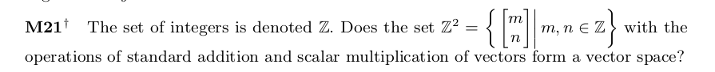

## Week 2 problem set for Discussion Board

```{r, echo=FALSE, out.width = '100%'}

```

Answer:

Multiplying a vector over the integers by another vector over the integers 

produces another vector over the integers.

Also multiplying a scalar by a integer vector also results in a integer vector

hence the set $Z^2$ forms a vector space.