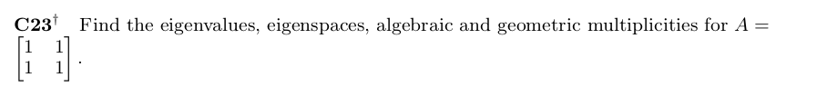

## Week 3 problem set for Discussion Board

```{r, echo=FALSE, out.width = '100%'}

```

- Approach is to first find the eigenvalues from the formula

$\det(A - \lambda I_n) = 0$ (n in this case is 2)

that is $\bigg\rvert\begin{pmatrix} 1 & 1 \\ 1 & 1 \end{pmatrix} - \begin{pmatrix} \lambda & 0 \\ 0 & \lambda \end{pmatrix}\bigg\rvert = 0$ (| |) bars means the determinant of the matrix.

simplfying the inside of the | | gives

$\bigg\rvert\begin{pmatrix} 1 - \lambda & 1 \\ 1 & 1 - \lambda \end{pmatrix} \bigg\rvert = 0$

the determinant of the above is

$(1 - \lambda) * (1 - \lambda) - 1 = 0$

factoring the $(1 - \lambda)^2$ and simplfying gives

$\lambda^2 - 2\lambda = 0$

and the eigenvalues are $\lambda = 0$ and  $\lambda = 2$

- Finding the vectors in the eigenspace $\xi_A(0)$ and $\xi_A(2)$ involves solving the equation

$\bigg(\begin{pmatrix} 1 & 1 \\ 1 & 1 \end{pmatrix} - \begin{pmatrix} \lambda & 0 \\ 0 & \lambda \end{pmatrix}\bigg) \begin{pmatrix} x_1 \\ x_2 \end{pmatrix}= \begin{pmatrix} 0 \\ 0 \end{pmatrix}$

for $\lambda = 0$ we have

$\begin{pmatrix} 1 & 1 \\ 1 & 1 \end{pmatrix}  \begin{pmatrix} x_1 \\ x_2 \end{pmatrix}= \begin{pmatrix} 0 \\ 0 \end{pmatrix}$

that is we have $x_1 + x_2 = 0$ and $x_1 + x_2 = 0$ that is $x_1 = -x_2$

for a non-zero vector we can put $x_1 = -1$ and $x_2 = 1$ as vectors in the nullspace of $A-\lambda I$

for $\lambda = 2$ we have

$\begin{pmatrix} -1 & 1 \\ 1 & -1 \end{pmatrix}  \begin{pmatrix} x_1 \\ x_2 \end{pmatrix}= \begin{pmatrix} 0 \\ 0 \end{pmatrix}$

that is we have $-x_1 + x_2 = 0$ and $x_1 - x_2 = 0$ that is $x_1 = x_2$

a non zero vector we can put $x_1 = 1$ and $x_2 = 1$ as vectors in the nullspace of $A-\lambda I$

- Finding algebraic multiplicity is finding the number of times the eigenvalue $\lambda$ appears as a root of the

characteristic polynomial

since each eigenvalue 0 and 2 appear only once as roots in the characteristic polynomial,

the algebraic multiplicity of those eigenvalues are both 1.

- The geometric multiplicity of an eigenvalue $\lambda$ of A is the dimension of $\xi_A(\lambda)$

for the eigenvalues 0 and 2, the dimensions of the nullspace of $A-\lambda I$ are simply 1.

