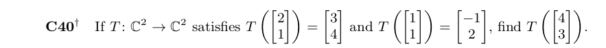

## Week 4 problem set for Discussion Board

```{r, echo=FALSE, out.width = '100%'}

```

As we are given $T = \bigg(\left[\begin{array} {rrr} 2 \\ 1 \end{array} \right] \bigg)$

and

$T = \bigg(\left[\begin{array} {rrr} 1 \\ 1 \end{array} \right] \bigg)$,

we can use the idea of the additive property $T(a + b) = T(a) + T(b)$ and add a 3rd

vector c such that $a + b + c = \left[\begin{array} {rrr} 4 \\ 3 \end{array} \right]$

with $a =\left[\begin{array} {rrr} 2 \\ 1 \end{array} \right]$

and

$b =\left[\begin{array} {rrr} 1 \\ 1 \end{array} \right]$

looking at the equation for $a + b + c$,

$c =\left[\begin{array} {rrr} 1 \\ 1 \end{array} \right]$ that is $c=b$

With the new information, we have

$T(a + b + c) =$
$T \bigg(\left[\begin{array} {rrr} 4 \\ 3 \end{array} \right] \bigg) =$
$T \bigg(\left[\begin{array} {rrr} 2 \\ 1 \end{array} \right] + 2 \left[\begin{array} {rrr} 1 \\ 1 \end{array} \right]\bigg) =$

$T \bigg(\left[\begin{array} {rrr} 2 \\ 1 \end{array} \right] \bigg) + 2 T \bigg(\left[\begin{array} {rrr} 1 \\ 1 \end{array} \right] \bigg) = \left[\begin{array} {rrr} 3 \\ 4 \end{array} \right] + \left[\begin{array} {rrr} -2 \\ 4 \end{array} \right] = \left[\begin{array} {rrr} 1 \\ 8 \end{array} \right]$