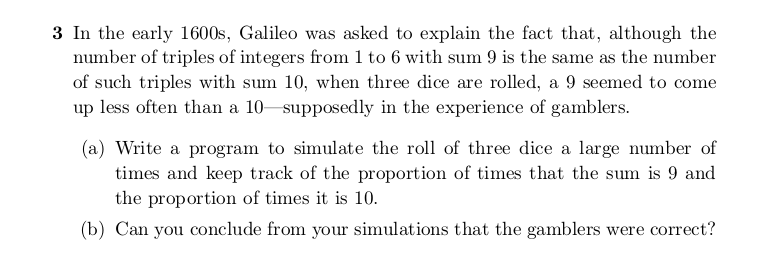

```{r, echo=FALSE, out.width = '100%'}

```

### The approach is to use simulation using R and using functions like sum and

### sample to sample data and keep track of occurences the sum of 3 dice were 9 and 10

```{r}
# number of times to run this simulation of 10000 trials/runs
n_sim <- 100 # 100 times simulate 10000 trials

total_times <- rep(FALSE, n_sim) # vector to store all simulation results

for (i in 1:n_sim){
  
  sum_9 <- 0 # counter for # of times sum == 9
  sum_10 <- 0 # counter for # of times sum == 10
  n <- 10000 # number of times to roll 3 dice

  # for loop to simulate 
  for (j in 1:n){
    dice <- sample(1:6, 3, replace = TRUE) # pick a number from 1 to 6 3 times with equal likelihood
    if (sum(dice) == 9){ # if the sum of the rolled 3 dice is 9
      sum_9 <- sum_9 + 1 # increment the counter
    }
    if (sum(dice) == 10){ # if the sum of the rolled 3 dice is 10
      sum_10 <- sum_10 + 1
    }
  }
  
  # check if the # of sum == 9 is less than # of sum == 10
  if (sum_9 < sum_10){
    total_times[i] <- TRUE # mark as true
  }
}
```

### Running this simulation 100 times of rolling 3 dice 10000 times:

```{r}
print(sum(total_times == TRUE))
```

### for (b), the can conclude the gamblers were right, sum of 9 comes up less

### frequently than sum of 10 for rolling 3 dice usually around 90% or more of the 

### time.