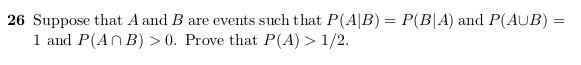

```{r, echo=FALSE, out.width = '100%'}

```

Answer:

- Using the formula for conditional probability for events A and B:

$P(A | B) = P(A \cap B) / P(B)$ and $P(B | A) = P(B \cap A) / P(A)$

we can rewrite the equality in the question to be:

a) $P(A \cap B)P(A) = P(B \cap A)P(B)$ using cross-multiplication.

- Per the probability communitive law for two events, $P(A \cap B) = P(B \cap A)$

thus we can divide the $P(A \cap B)$ on both sides to get

b) $P(A) = P(B)$

- We're not done yet. We have to show $P(A) > 1/2$ and to do this, recall the formula

of $P(A \cup B)$ that is the probability of either of the two events A and B happening

is:

- $P(A \cup B) = P(A) + P(B) - P(A \cap B)$

- We can solve for P(B) to get

- $P(A \cup B) + P(A \cap B) - P(A) = P(B)$ and plug it into b. to get

- $P(A) = P(A \cup B) + P(A \cap B) - P(A)$

- Adding $P(A)$ on both sides gives

- $2P(A) = P(A \cup B) + P(A \cap B)$

- Dividing on both sides by 2 gives

- $P(A) = P(A \cup B)/2 + P(A \cap B)/2$

- $P(A \cup B) = 1$ as per the information given so

- $P(A) = 1/2 + P(A \cap B)/2$

- Finally note that the second operand $P(A \cap B)/2$ will always be within (0,1]

- so $P(A) \gt 1/2$
