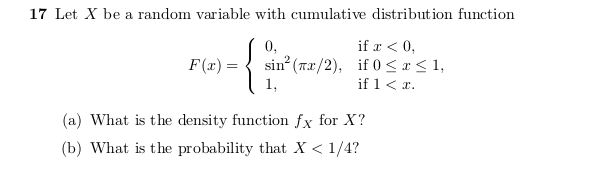

```{r, echo=FALSE, out.width = '100%'}

```

Answer:

a) The density function $f_X$ for X can be computed by taking the derivative of the 

cumulative distribution function $F(X)$

The derivative of a constant is 0 so we will only differentiate the function

$d/dx(F(X)) = d/dx(sin^2(\pi x/2))$ for $0 \le x \le 1$

We could use the chain rule to differentiate the function or use a trignometric identity:

- $sin^2(\theta) = (1-cos(2\theta)) / 2$

to make it easier.

so $d/dx(1/2 - cos(2(\pi x/2)) = d/dx\big(1/2 - cos(\pi x) / 2\big) =$

$\pi sin(\pi x)/2 = f_X$

b) Finding the probably we have to use the cumulative distribution function F(X)

and compute integrals.

For the probability that X < 1/4, we compute

$\int_{0}^{1/4} sin^2(\pi x/2) dx$

we use the trig identity again to make integrating the function easier

$1/2\int_{0}^{1/4} (1 - cos(\pi x)) dx = 1/2 \bigg[x - sin(\pi x)/ \pi \bigg]_{0}^{1/4} =$

$1/2\bigg(1/4 - sin(\pi/4)/ \pi\bigg) = 1/8 - \sqrt{2}/4 \pi$