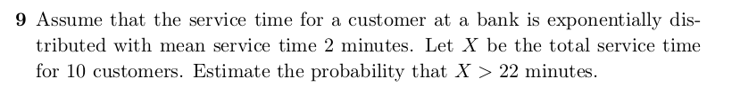

```{r, echo=FALSE, out.width = '100%'}

```

Answer:

we are given the mean $\mu = 2$ minutes and total service time X = 10 customers

since we have 10 customers every 2 minutes on average we have 5 customers/minute

so $\mu_{updated} = X/\mu = 10/2 =5$ and $\lambda = 1/\mu_{updated} = 1/5 = 0.2$

in this case, $x = 22$

$P(X > x) = 1 - P(X \leq x)$ 

$P(X \leq x) = 1 - e^{-\lambda x}$

so

$P(X > x) =P(X > 22) = 1 - P(X \leq 22) = 1 - \big[1-e^{-0.2*22}\big] = e^{-0.2*22} =0.0123$

That is the probability that the total service time for 10 customers is greater than

22 minutes is 0.0123 (rounded to 4 decimal places) or about 1.23%

- R code to show this:

```{r}
mu <- 2
X <- 10
mu_updated <- X / mu
lambda <- 1 / mu_updated
x <- 22
round(pexp(x, rate = lambda, lower.tail = FALSE), 4)
```