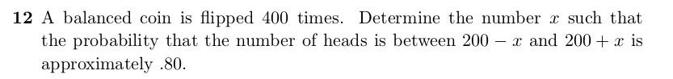

```{r, echo=FALSE, out.width = '100%'}

```

We can use the Central Limit Theorem and the Approximating the Binomial probability.

We're given

- n = 400 trials

- p = 0.5 (and as a fair coin q the probability of failure is also 0.5)

- Probability of number of heads for 400 coin flips between the given intervals is $\approx 0.8$

- goal is to find x (or $S_n^*$ ) such that 
$P((200 - x -0.5 - E[x])/\sigma \leq x \leq (200 + 0.5 + x - E[x])/\sigma) \approx 0.8$

It is know that the expected value of flipping a coin n times is $E[x] = np = 400*0.5 = 200$

The standard deviation $\sigma = \sqrt{npq} = \sqrt{400*0.5*0.5} = \sqrt{100} = 10$

As these are 400 trials of a binomial distribution, we standardize the above equation so we can

find the z-score that corresponds to the probability $\approx 0.8$ that is
$$
\begin{aligned}
P(200 - x \leq x \leq 200 + x) \approx P((200 - x - 0.5 - 200)10 \leq x \leq (200 + x + 0.5 - 200)/10) \\
= P((-0.5 - x)/10 \leq x \leq (0.5 + x)/10) \\
\approx NA(-(0.5+x)/10, (0.5+x)/10) \\
\text{For a standard normal distribution as it is symmetric around 0, we can re-write} \\
NA(-(0.5+x)/10, (0.5+x)/10) \\
\text{as} \\
2*NA(0, (0.5+x)/10)) \approx 0.8
\end{aligned}
$$
Dividing 2 on both sides of the equation gives $NA(0, (0.5+x)/10) \approx 0.4$

As the area under the normal curve is $NA(0, (0.5+x)/10) \approx 0.4$ we can let $z = (0.5 + x) /10$ and look up the z value that is $\approx 0.8$

and using a standard probability table (there are plenty of websites and books that show it), we find the closest z value

with probability $\approx 0.8$ is $z =1.3$.

Finally, we can solve for x by solving 

$z = 1.3 =(0.5 + x) / 10$ which gives $x = 12.5$ so this means $x = 12.5$ to have the probability that the number of heads be

about 0.8 for 400 fair coin flips.