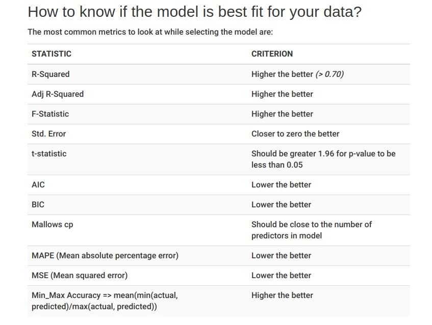

Introduction
========================================================

This presentation will about Linear Regression and it's alternatives like partial
least squares and Penalized regression models. I will go over each one in detail
starting with

- Linear Regression
- Penalized Regression Models (LASSO, Ridge Regression and elastic net)

Linear Regression
========================================================

- Linear Regression is one of the most basic tools a Data Scientist or Analyst can
use for analyzing data. It is also used as a prerequiste for other advanced regression and
machine learning techniques.

- In its general form it is the formula


$$
\begin{align}
y_i = b_0 +b_1x_{i1} + b_2x_{i2} + ... + b_px_{iP} + \epsilon_i \tag{1}
\end{align}
$$

where 

- $y_i$ represents the numerical response of observation i
- $b_0$ represents the estimated intercept
- $b_j$ is the estimated coefficient of the jth predictor
- $x_{ij}$ is the value of the jth feature of observation i
- P is the number of predictors or explanatory variables
- $\epsilon_i$ is random error that can't be explained by the model

Ordinary Least Squares
========================================================

- When performing linear regression, the goal is to find coefficients that minimize the sum-of-squared
errors (SSE) between the actual value of the response and the predicted response.

- The (SSE) is defined as the following

$$
\begin{align}
SSE = \sum_{i=1}^n (y_i - \hat{y_i})^2 \tag{1}
\end{align}
$$

- This equation contains the coefficient estimates for each predictor in a vector.

- It can be shown that the coefficients that minimize the SSE is the matrix equation
(Note this would involve a combination of Matrix Algebra and Solving a system of 
partial derivatives to derive). There is a problem with this solution which will be addressed
later in the presentation.

$$
\begin{align}
(X^TX)^{-1}X^Ty
\end{align}
$$

Multiple Linear Regression Caveats
========================================================

- Several flaws in multiple linear regression. For example, the response variable
is a linear model and that if the data have some non-linear structure in the mix,
the multiple linear regression technique may not be accurate.

- There are many statistics that can tell if the multiple linear regression model you
are using is a good one or not.

- Having data with large residuals when doing a multiple regression model can negatively
impact your model.

- If the data are shown to not have near constant variance, this is also an indictor that
the model needs to be adjusted and may need transformations, feature extraction etc.

- If the residual plot does not follow a normal or near-normal distribution, that is also
a bad sign.

- Using Q-Q plots can also be a good metric to test and see as well.

- If there are more predictors than observations, Eq. (2) cannot be inverted.

- Other metrics like $R^2$, $R^2_{adj}$, p-value and F-test come in handy as well.
R's lm() function gives you these statistics.

Table Summary of Metrics When Fitting a Multiple Linear Regression Model
========================================================



Source: http://r-statistics.co/Linear-Regression.html

Linear Regression Example: (good fit and not-so-good fit)
========================================================

- Let's look at some R code for creating a multiple regression model
The R built-in dataset mtcars

```{r linregexample_getdata,eval=TRUE}
# fit a linear model
colnames(mtcars)
lm_mtcars <- lm(mpg ~ ., data = mtcars)
summary(lm_mtcars)

library(Matrix)
X <- as.matrix(mtcars[,2:11])
y <- as.matrix(mtcars$mpg)
solve(t(X) %*% X) %*% 
  (t(X) %*% y)
```

- Note that using the Matrix equation to solve for the coefficients is almost
equal to the coefficient values used by R's lm() function

Summary of Results
========================================================

- We saw from the previous slide that R's lm() function along with the summmary()
function gave us some insight metrics for our model. Let's review in summary:

    - Residuals:
        These values show the summary of the residual values of our fitted model showing
        the min, 1st quartile, median, 3rd quartile and max value
    
    - Coefficients:
        For each predictor in our model, it shows the estimated coefficient $b_i$,
        the standard error of the coefficient, it's t-value and it's p-value. Note
        that having a low p-value < 0.05 for a 95% confidence interval means that the
        predictor is significant in the model. We can say we fail to reject the null
        hypothesis ($b_i = 0$) and favor the alternative that is $b_i \neq 0$)
    
    - Significant codes:
        These codes show the characters that indicate if the p-value is less than a certain
        threshold. It's used more for readbility.
    
    - Residual standard error: 
        This is nothing more than the positive squared root of the mean square error that is
        $RSE = \sqrt{MSE}$
    
    - R-Squared and Adjusted R-Squared:
        The $R^2$ and $R^2_{adj}$ are the R-squared and Adjusted R-squared values respectively.
        Mathematically, they are calculated as
    
$$
\begin{aligned}
R^2 = 1 - SSE/SST = \sum{(y - \hat{y})^2} / \sum{(y - \bar{y})^2} \\
R^2_{adj} = R^2\big(n-1 / n-k-1 \big)
\end{aligned}
$$
with $\hat{y}$ = estimate of y (from multiple regression model) and
$\bar{y}$ = mean of y values and n and k are the number of observations and predictions
respectively.

Residual Plots 
========================================================

- Finally, let's look at some plots based on our model if it is a good fit in explaining
the relationship to mpg (miles per gallon)

- Residual Plots (If the residual plot follows a near normal distribution, this is a good sign)

```{r residualplot, eval=TRUE}
hist(lm_mtcars$residuals)
```

- Q-Q plot and REsidual Plot

```{r q-qplot, eval=TRUE}
qqnorm(lm_mtcars$residuals)
qqline(lm_mtcars$residuals)

plot(mtcars$mpg, lm_mtcars$residuals)
abline(0, 0)
```

Penalized Models
========================================================

- Now that we now know about linear regression, let's introduce the idea of 
penalized models.

- Sometimes, a model may have overfitting issues and may not be able to accurately
predict future observations. Also, penalized models are helpful when there are issues
with collinearity.

- Another issue is that if there are large correlations between features that the
variance will be very large. As such, penalized methods/models help to reduce variance
but introduce bias into the picture.

- I will talk about 3 penalized models in this presentation

    - Ridge Regression
    
    - LASSO Regression (Least Absolute shrinkage and selection operator) model
    
    - Elastic net (Ridge Regression and LASSO penalties combined)
    
- These regularization methods impose penalities on coefficients and R has functions
to use these techniques along with finding the optimal value of lambda which we'll see
in the next slide.

Ridge Regression
========================================================

- Adds a penalty on the sum of the squared regression parameters and is defined by
the formula below:

$$
\begin{aligned}
SSE_{L_2} = \sum_{i=1}^n (y_i - \hat{y_i})^2 + \lambda \sum_{j=1}^P \beta_j^2
\end{aligned}
$$

- $L_2$ is for the second-order penalty hence the squared value in the parameter
estimates.

- What the second term (penalty) does is that the coefficient estimates can become
large if there is a reduction on the SSE.

- For large $\lambda$ reduces the estimates near 0. However, the parameters never
become actually zero and in addition, ridge regression does not perform feature 
selection.

Ridge Regression Example
========================================================

- Let's use the R library glmnet to build a ridge regression model using the mtcars
dataset as an example.

```{r ridgeregression, eval=TRUE}
library(glmnet)
library(dplyr)
# fit a ridge regression model using all features
# alpha = 0 is the ridge regression method alpha =1 is LASSO
# variables X and y are from earlier slides regarding linear regression

# center the response variable mpg
y <- y %>% scale(center = TRUE, scale = FALSE)
ridge_mpg <- glmnet(X, y, alpha = 0, standardize = TRUE)
summary(ridge_mpg)
```

- The glmnet() function ran with many lambda values. To find the optimal lambda
value, we can use the cv.glmnet() function. We then plot the lambda values and
their MSE's to see which is the $min(\lambda)$ using the lambda.min attribute

```{r plotlambdas, eval=TRUE}
cv_fit_mpg <- cv.glmnet(X, y, alpha=0, standardize =  TRUE)
plot(cv_fit_mpg)
```

- The two lines represent the min $\lambda$ value and the 1 standard deviation away
from the min $\lambda$ value respectively.

- Min $\lambda$ for our model:

```{r minlambda, eval=TRUE}
min_lambda <- cv_fit_mpg$lambda.min
min_lambda
```

- With our lambda that minimizes the MSE, let's see the coefficients as well

```{r finalmodel, eval=TRUE}
coef(cv_fit_mpg, s = "lambda.min")
```

LASSO (Least Absolute Shrinkage and Selection Operator)
========================================================

- While ridge regression penalizes the sum of squared coefficnents, LASSO penalizes
the sum of absolute values that is:

$$
\begin{aligned}
SSE_{L_1} = \sum_{i=1}^n (y_i - \hat{y_i})^2 + \lambda \sum_{j=1}^P |{\beta_j}|
\end{aligned}
$$

- Another neat feature is that LASSO may actually make a coefficient = 0 so therefore
it also does feature selection.

- Much like Ridge Regression, we can get the $\lambda$ value that minimizes the MSE
as well as extract the coefficients from it. Note that if a feature coefficient has
just '.' is because LASSO penalized that coefficient to be zero and has done feature
selection.

- In R when using glmnet() and cv.glmnet, set the alpha parameter to be 1 to let R
know you're doing the LASSO technique.

- Let's see an example in the next slide of LASSO in action.

LASSO Example
========================================================

- Using the mtcars dataset, let's use LASSO to see what are the coefficients and
the optimal $\lambda$ parameter.

```{r lassoregression, eval=TRUE}
# fit a LASSO regression model using all features
# alpha = 0 is the ridge regression method alpha = 1 is LASSO
# variables X and y are from earlier slides regarding linear regression

# center the response variable mpg
lasso_mpg <- glmnet(X, y, alpha=1, standardize = TRUE)
summary(lasso_mpg)

lasso_cv_fit_mpg <- cv.glmnet(X, y, alpha=1, standardize = TRUE)
plot(lasso_cv_fit_mpg)
```

- Optimal lambda to minimize MSE

```{r lassominlambda, eval=TRUE}
lasso_min_lambda <- lasso_cv_fit_mpg$lambda.min
lasso_min_lambda
```

- Which coefficients were not penalized according to LASSO

```{r lassocoefficients, eval=TRUE}
coef(lasso_cv_fit_mpg, s = "lambda.min")
```

- Using the "lambda.min" as the lambda value has shown that LASSO only kept
4 variables in our model to use and penalized the rest.

- For either ridge regression or LASSO regression, one can also use "lambda.1se"
which means use a lambda value that is 1 standard error from the minimum.

- Using that, you might get a lambda that has a larger or smaller MSE depending
on the data.

Elastic Net (Best of Both Worlds)
========================================================

- I've talked about ridge and LASSO regression. Both are good penalization methods
but what if you wanted to use both?

- LASSO does well when there aren't many parameters and some are already close to 0

- Ridge regressions works well if there are many parameters of almost the same value.

- LASSO may also take away variables that actually may greatly influence the response
variable.

- Introducing Elastic Net which combines both and the function is as follows:

$$
\begin{aligned}
SSE_{E_{net}} = \sum_{i=1}^n (y_i - \hat{y_i})^2 + 
\lambda_1 \sum_{j=1}^P \beta_j^2 + \lambda_2 \sum_{j=1}^P |{\beta_j}|
\end{aligned}
$$

- With this, you get the feature selection power of LASSO and penalties of both
methods in one.

- Elastic Net example

```{r enetregression, eval=TRUE}
# Elastic Net, use alpha = 0.5

enet_mpg <- glmnet(X, y, alpha=0.5, standardize = TRUE)
summary(lasso_mpg)

enet_cv_fit_mpg <- cv.glmnet(X, y, alpha=0.5, standardize = TRUE)
plot(enet_cv_fit_mpg)
```

```{r enetminlambda, eval=TRUE}
enet_min_lambda <- enet_cv_fit_mpg$lambda.min
enet_min_lambda
```

- Which coefficients were not penalized according to Enet

```{r enetcoefficients, eval=TRUE}
coef(enet_cv_fit_mpg, s = "lambda.min")
```

Summary and Wrap Up
========================================================

- Linear Regression enables us to create linear models that can minimize the SSE

- There are various ways and diagnostics to see if your linear model is a good fit
to your data.

- There is a matrix solution that finds the coefficients of the SSE but may not
work if the data exhibit collinearity and/or the number of predictors > number of observations
to which the matrix cannot be inverted.

- Penalized methods allow us to decrease the variance while introducing some bias
into the mix of our model. This is to also help reduce the MSE of your model.

- Ridge regression, LASSO and elastic net can accomplish this by picking the minimum
$\lambda$ or 1 standard error (you can also make your own range of $\lambda$ values
and select the number of folds as well)

- You can select (not shown on the slide) the penalization method by computing each one's
$R^2$ value, AIC, BIC.

- You don't have to select the $\lambda$ that minimizes the MSE, you can select your own
$\lambda$. Experiment with different values and number of folds to tune your model.

Thank you!!!